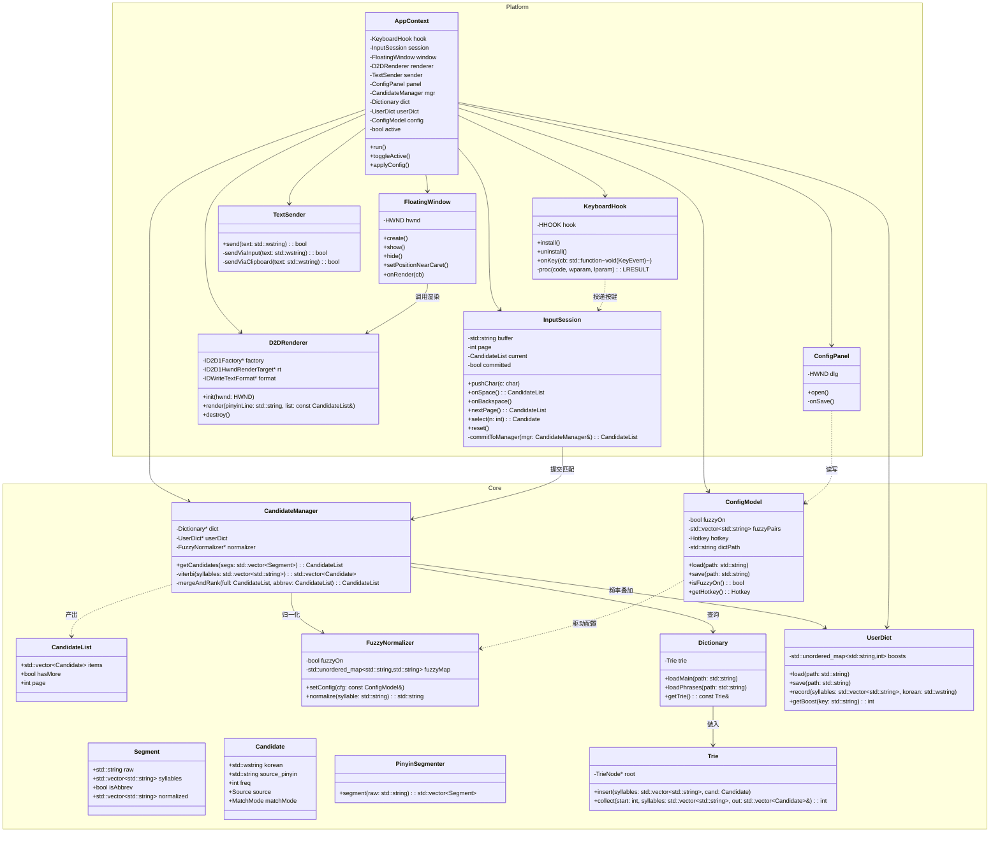
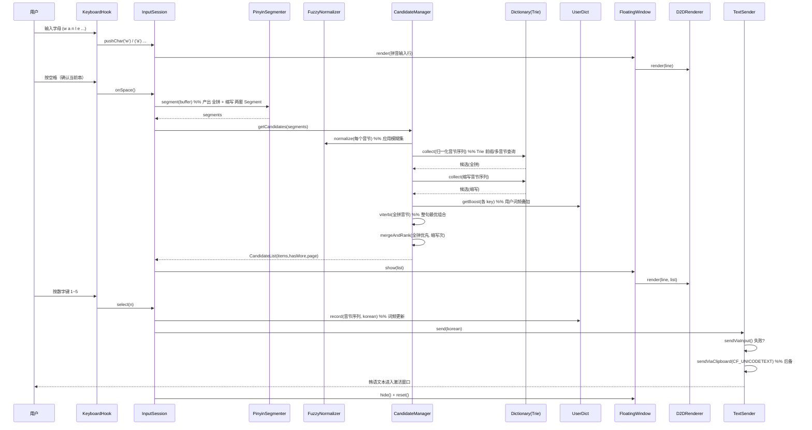
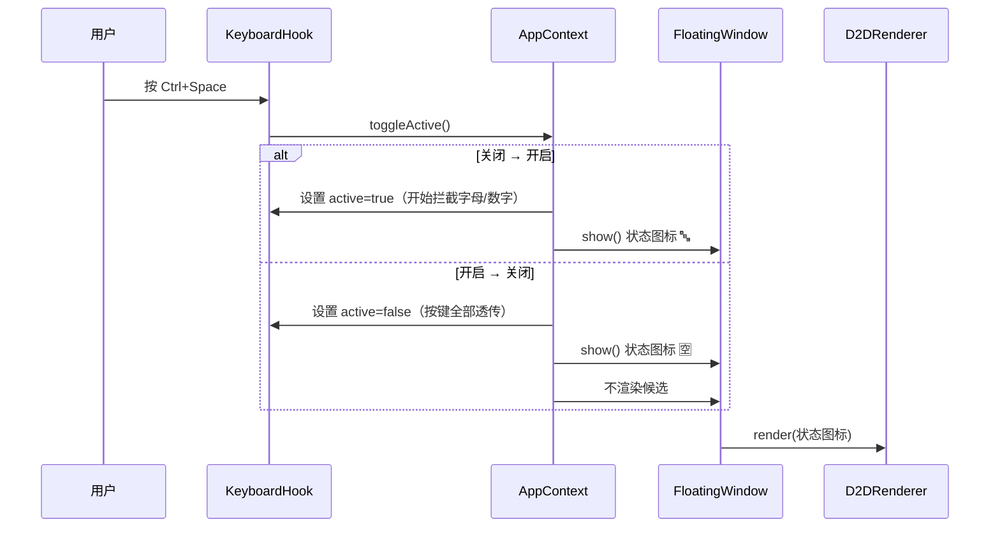
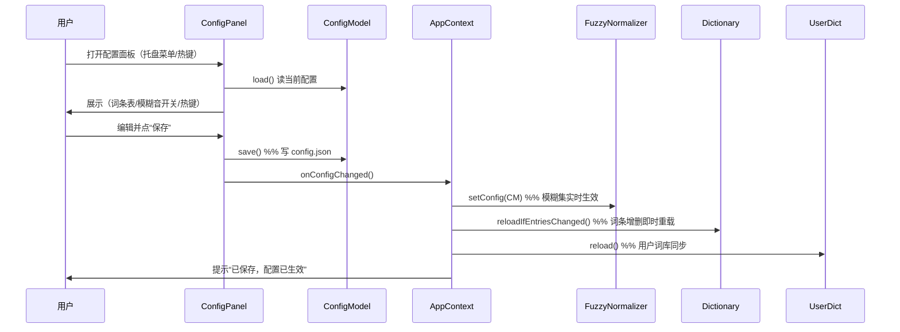
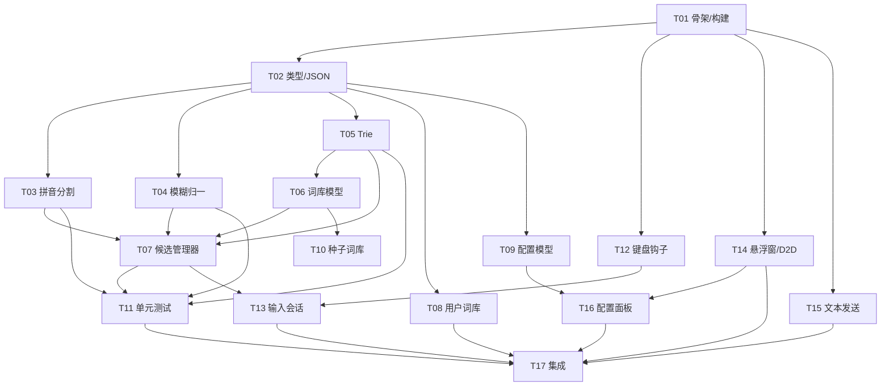

# HanPinyin 系统架构设计 + 任务分解

> 文档类型：架构设计 + 任务分解（Architect 产出）
> 项目代号：HanPinyin —— 基于汉语拼音的韩语输入法（韩服专用）
> 作者：高见远（software-architect）
> 版本：v0.1
> 技术栈基线：C++17 + Win32 API + Direct2D + SendInput（零第三方依赖）

---

## 0. 关键设计决策吸收表（来自澄清阶段）

| # | 决策 | 落地点 |
|---|------|--------|
| D1 | **渲染技术 = 严格 Direct2D**（拒绝 GDI+ 降级） | `D2DRenderer` 仅用 Direct2D/DirectWrite，不做 GDI 分支（§3、§文件列表） |
| D2 | **缩写输入 = 支持，完整拼音优先** | `PinyinSegmenter` 产出全拼+缩写两套切分；`CandidateManager` 全拼候选恒优先于缩写（§3、§7 接口契约） |
| D3 | **模糊音 = 默认开启完整模糊集**（可关） | `FuzzyNormalizer` 内置完整映射；`ConfigModel.fuzzyOn` 默认 true（§3、§8） |
| D4 | **配置 = 图形配置面板**（非手改 JSON） | 新增 `ConfigPanel` 模块（增删词条/模糊音开关/热键自定义），写回 `ConfigModel` + JSON（§文件列表、T16） |

---

## 1. 实现方案 + 框架选型

### 1.1 技术栈与职责

| 层 | 技术 | 职责 |
|----|------|------|
| 纯逻辑核心层（可测） | C++17 标准库（`std::string`/`std::wstring`/`std::vector`/`std::unordered_map`） | 拼音分割、模糊归一、Trie、候选排序、整句 Viterbi、词库/用户词库/配置数据模型、极简 JSON |
| 平台层（难测） | Win32 API（`windows.h`/`WinUser.h`） | 全局键盘钩子、悬浮窗框架、文本发送 |
| 渲染层（难测） | Direct2D + DirectWrite（`d2d1.h`/`dwrite.h`） | 悬浮窗文字/候选列表渲染 |
| 仿真输入层 | `SendInput` + 剪贴板 `CF_UNICODETEXT` | 把韩语串送入激活窗口 |

### 1.2 为什么零外部依赖

- **仅依赖 Windows SDK（系统自带）+ C++ 标准库**，不引入 Boost / Qt / fmt / nlohmann-json / abseil 等。
- 用标准容器与算法替代 Boost；用原生 Win32 无边框窗口替代 Qt；用 `std::wstring` + 自写极简格式化替代 fmt。
- 词库 JSON 用**自研极简解析器** `core/json.hpp`（~300 行，仅支持所需子集：对象/数组/字符串/数字/布尔），避免任何 header-only 外部库。
- 收益：产物为单一 `.exe`、无 DLL 分发负担、除 `msvcrt` 外零运行时依赖、启动快、体积可控、便于静态分析与审计。

### 1.3 内存 < 20MB 的达成思路

- **主词库全量驻留**（约 3000 条）：每条 = 归一化拼音 + 若干韩文候选（含词频），估算 **5~8MB**。
- **Trie 节点**：子节点用定长/指针表（拼音字母表有限），节点数 ≈ 词条音节数 × 2，估算 **1~2MB**。
- **用户词库常驻**（增量小）：< 0.5MB。
- **悬浮窗 D2D 资源**（画刷 / 文本格式 / 几何）：固定开销 < 1MB。
- 不加载任何图片 / 字体文件（复用系统 Segoe UI / 默认字体），无网络缓冲。
- **总预算约 10MB**，留足余量；不引入懒加载 / 内存映射，保持设计简单。

### 1.4 架构模式与关键算法

- 架构：**管道 + 会话状态机**。键盘事件 → 输入会话（累积/确认/翻页）→ 解析管道（分割→归一→查词→排序→Viterbi）→ 渲染 → 发送。
- 拼音分割：**正向最大匹配（FMM）** + 缩写分支（每字符作为音节首字母的候选切分）。
- 整句最优组合：**Viterbi（动态规划）**，状态 = 当前位置，转移代价 = 词频负对数，状态回溯得最优词序列。
- 候选排序：词频降序；**全拼匹配恒优先于缩写匹配**；用户词库频率叠加提升个人常用词。

### 1.5 构建目标（分层，便于 QA 单测）

- `hanpinyin_core`（STATIC，纯逻辑，**不含 `windows.h`**）：核心算法 + 数据模型 + 极简 JSON。
- `hanpinyin_core_tests`（可执行，纯逻辑）：单元测试，仅链接 core，可在无窗口环境编译运行。
- `hanpinyin`（可执行，x64）：平台层 + 渲染层 + `AppContext`，链接 core。

> ⚠️ **位宽一致性**：目标游戏（韩服 LOL）为 64 位进程，`WH_KEYBOARD_LL` 必须与目标同位数 → **构建目标固定 x64**，否则无法拦截 64 位窗口消息。

---

## 2. 文件列表及相对路径

```
HanPinyin/
├── CMakeLists.txt                  # 顶层构建（MSVC 14.44，定义 core / core_tests / app 三目标）
├── README.md                       # 编译/运行说明
├── data/                           # 词库与配置数据（JSON，UTF-8 无 BOM）
│   ├── main_dict.json              # 主词库（约 3000 条 拼音→韩语）
│   ├── phrases.json                # 短语库（约 200 条 游戏常用语）
│   ├── user_dict.json              # 用户词库（运行时生成，初始可空 {}）
│   └── schema.md                   # 三套 JSON schema 说明
├── src/
│   ├── core/                       # 【纯逻辑核心层 · 可独立编译/测试 · 严禁 #include <windows.h>】
│   │   ├── types.h                 # 公共类型：Segment / Candidate / CandidateList / Source / MatchMode
│   │   ├── types.cpp               # 类型构造与辅助
│   │   ├── json.hpp                # 极简 JSON 解析/序列化（header-only，仅所需子集）
│   │   ├── pinyin_segmenter.h      # 拼音音节分割 + 首字母缩写分支
│   │   ├── pinyin_segmenter.cpp
│   │   ├── fuzzy_normalizer.h      # 模糊音归一化（完整模糊集，可配置）
│   │   ├── fuzzy_normalizer.cpp
│   │   ├── trie.h                  # 拼音→韩语 前缀树（按音节切边）
│   │   ├── trie.cpp
│   │   ├── dictionary.h            # 主词库/短语库 数据模型 + JSON 装载注入 Trie
│   │   ├── dictionary.cpp
│   │   ├── user_dict.h             # 用户词库 JSON 持久化 + 词频更新
│   │   ├── user_dict.cpp
│   │   ├── candidate_manager.h     # 候选排序 + Viterbi 整句 + 全拼优先 + 缩写合并
│   │   ├── candidate_manager.cpp
│   │   ├── config_model.h          # 配置数据结构（模糊音开关/模糊集/热键/词库路径）
│   │   └── config_model.cpp
│   ├── platform/                   # 【Win32/UI 平台层 · 难测】
│   │   ├── keyboard_hook.h         # WH_KEYBOARD_LL 全局钩子 + Ctrl+Space 切换
│   │   ├── keyboard_hook.cpp
│   │   ├── input_session.h         # 输入会话状态机（拼音串累积/空格确认/退格/翻页/数字选择）
│   │   ├── input_session.cpp
│   │   ├── floating_window.h       # Win32 无边框透明窗口框架（跟随光标）
│   │   ├── floating_window.cpp
│   │   ├── d2d_renderer.h          # Direct2D + DirectWrite 文本渲染（严格 D2D，无 GDI）
│   │   ├── d2d_renderer.cpp
│   │   ├── text_sender.h           # SendInput 发送 + 剪贴板 CF_UNICODETEXT 后备
│   │   ├── text_sender.cpp
│   │   ├── config_panel.h          # 图形配置面板（Win32 对话框：增删词条/模糊音/热键）
│   │   ├── config_panel.cpp
│   │   ├── app_context.h           # 全局编排（黏合 core + platform + renderer）
│   │   └── app_context.cpp
│   └── app/
│       └── main.cpp                # WinMain 入口，构造 AppContext 并运行消息循环
└── tests/                          # 【纯逻辑单元测试 · MSVC 14.44 下编译运行】
    ├── CMakeLists.txt              # 测试目标配置（也可用 ctest）
    ├── test_pinyin_segmenter.cpp   # 全拼 + 缩写切分用例
    ├── test_fuzzy_normalizer.cpp   # 完整模糊集用例（含开关）
    ├── test_trie.cpp               # 构建与前缀/多音节查询
    ├── test_candidate_manager.cpp  # 词频排序 + 全拼优先
    └── test_viterbi.cpp            # 整句最优组合用例
```

**层次职责边界（给工程师的硬约束）**
- `core/` 中**任何文件都不得 `#include <windows.h>`**、不得引用 `platform/` 与 `d2d_renderer.*`。core 只依赖标准库与自身。
- `platform/` / `app/` 可依赖 `core/`，反之禁止。
- 这样 QA 可用 `cl /std:c++17 /EHsc /utf-8 /I src/core tests/*.cpp src/core/*.cpp` 在无 Win32 环境下编译并运行核心逻辑测试。

---

## 3. 数据结构与接口（classDiagram）



---

## 4. 程序调用流程（sequenceDiagram）

### 4.1 主链路：按键 → 候选 → 选择 → 发送



### 4.2 旁路 A：Ctrl+Space 切换激活/关闭



### 4.3 旁路 B：配置面板打开 / 保存



---

## 5. 有序任务列表（含依赖关系，按实现顺序）

> 标注：依赖指“必须先完成”的前置任务。优先级 P0=必须 / P1=应有。
> 纯逻辑任务（T02–T11）可在无 Win32 环境下完成并被 QA 单测；平台任务（T12–T17）依赖它们或构建骨架。

| 任务ID | 任务名 | 源文件（来自文件列表） | 依赖 | 优先级 |
|--------|--------|------------------------|------|--------|
| **T01** | 项目骨架与构建系统 | `CMakeLists.txt`、`src/core/*.h`(空壳)、`src/platform/*.h`(空壳)、`tests/CMakeLists.txt` | 无 | P0 |
| **T02** | 核心公共类型 + 极简 JSON 解析器 | `src/core/types.h`、`src/core/types.cpp`、`src/core/json.hpp` | T01 | P0 |
| **T03** | 拼音分割器（含首字母缩写分支） | `src/core/pinyin_segmenter.h/.cpp` | T02 | P0 |
| **T04** | 模糊音归一化（完整模糊集，可配置） | `src/core/fuzzy_normalizer.h/.cpp` | T02 | P0 |
| **T05** | Trie 拼音前缀树（构建与查询） | `src/core/trie.h/.cpp` | T02 | P0 |
| **T06** | 词库数据模型 Dictionary（装载主词库/短语库注入 Trie） | `src/core/dictionary.h/.cpp` | T02, T05 | P0 |
| **T07** | 候选词管理器（词频排序 + Viterbi 整句 + 全拼优先 + 缩写合并） | `src/core/candidate_manager.h/.cpp` | T03, T04, T05, T06 | P0 |
| **T08** | 用户词库 UserDict（JSON 持久化 + 词频更新） | `src/core/user_dict.h/.cpp` | T02 | P0 |
| **T09** | 配置数据模型 ConfigModel（模糊音开关/模糊集/热键/路径） | `src/core/config_model.h/.cpp` | T02 | P1 |
| **T10** | 种子主词库 + 短语库 JSON 采集（约 3000 + 200 条） | `data/main_dict.json`、`data/phrases.json`、`data/schema.md` | T06(schema) | P0 |
| **T11** | 核心纯逻辑单元测试（segmenter/normalizer/trie/candidate/viterbi） | `tests/test_*.cpp` | T03, T04, T05, T07 | P0 |
| **T12** | 键盘钩子 KeyboardHook（WH_KEYBOARD_LL + Ctrl+Space 切换） | `src/platform/keyboard_hook.h/.cpp` | T01 | P0 |
| **T13** | 输入会话状态机 InputSession（累积/空格确认/退格/翻页/数字选择） | `src/platform/input_session.h/.cpp` | T07, T12 | P0 |
| **T14** | 悬浮窗 Win32 框架 + Direct2D 渲染器（无边框透明窗 + D2D 文本） | `src/platform/floating_window.h/.cpp`、`src/platform/d2d_renderer.h/.cpp` | T01 | P0 |
| **T15** | 文本发送器 TextSender（SendInput + 剪贴板 CF_UNICODETEXT 后备） | `src/platform/text_sender.h/.cpp` | T01 | P0 |
| **T16** | 图形配置面板 ConfigPanel（增删词条/模糊音开关/热键自定义） | `src/platform/config_panel.h/.cpp` | T09, T14 | P1 |
| **T17** | 应用编排 AppContext + 集成与全局一致性（端到端联调） | `src/platform/app_context.h/.cpp`、`src/app/main.cpp` | T08, T11, T13, T14, T15, T16 | P0 |

### 任务依赖图



---

## 6. 依赖包列表

| 类别 | 名称 | 版本/说明 | 是否第三方 |
|------|------|-----------|-----------|
| 编译器 | MSVC (VS 2022 Community) | 14.44（对应 VS 17.14） | 否（系统 SDK 自带工具链） |
| 系统 SDK | Windows SDK | 10.0.x（含 `windows.h`/`d2d1.h`/`dwrite.h`） | 否 |
| 标准库 | C++17 标准库（`/std:c++17`） | `<string>`/`<vector>`/`<unordered_map>` 等 | 否 |
| JSON | 自研 `core/json.hpp` | 极简子集解析器 | 否（自写） |
| 构建 | CMake | ≥ 3.20（生成 VS2022 工程） | 否（构建工具） |
| 测试 | CTest / 自写断言 | 纯逻辑单测 | 否 |

**结论：无第三方运行时/编译依赖。**

### MSVC 14.44 编译要点

- 顶层用 CMake：
  ```bat
  cmake -B build -G "Visual Studio 17 2022" -A x64
  cmake --build build --config Release
  ```
- 纯逻辑单测直接用 `cl`（无需链接 Windows 库，core 不含 `windows.h`）：
  ```bat
  cl /std:c++17 /EHsc /utf-8 /I src/core ^
     tests/test_trie.cpp tests/test_pinyin_segmenter.cpp ^
     tests/test_fuzzy_normalizer.cpp tests/test_candidate_manager.cpp ^
     tests/test_viterbi.cpp ^
     src/core/types.cpp src/core/json.cpp src/core/pinyin_segmenter.cpp ^
     src/core/fuzzy_normalizer.cpp src/core/trie.cpp src/core/dictionary.cpp ^
     src/core/user_dict.cpp src/core/candidate_manager.cpp src/core/config_model.cpp ^
     /Fe:build/hp_core_tests.exe
  build/hp_core_tests.exe
  ```
- 关键编译开关：`/std:c++17`、`/utf-8`（源文件与执行字符集均 UTF-8，避免韩文乱码）、`/EHsc`、`/permissive-`、`/A x64`。
- 源文件统一 **UTF-8 带 BOM**（防止 MSVC 把含韩文字面量的 `.cpp` 误判为本地编码）。

---

## 7. 共享知识（跨文件约定）

### 7.1 编码约定
- 源文件：UTF-8 **带 BOM**；编译开关 `/utf-8`。
- 拼音（`std::string`）：纯 ASCII，小写，无空格（输入时连续，分割后再按音节存 `vector<string>`）。
- 韩文（`std::wstring`，UTF-16LE）：core 层与平台层统一用 `std::wstring` 承载韩语文本，**不引入 `windows.h` 也能用**（标准库类型）。
- 禁止在 `core/` 内使用 `TCHAR` / `L""` 宽字面量宏技巧替代 `std::wstring`；韩文常量在 core 中以 `std::wstring` 字面量表示。

### 7.2 拼音归一化规范
1. 输入 lowercase；非法字符（非 a–z）直接透传或丢弃（由 `InputSession` 决定）。
2. 按“声母 + 韵母”合法组合表做正向最大匹配切分（合法音节表见 `pinyin_segmenter` 内 `kValidSyllables`）。
3. 每个音节过 `FuzzyNormalizer`：当 `fuzzyOn` 时应用映射 `zh→z, ch→c, sh→s, an→ang(双向?), en→eng, in→ing, n→l, r→l`（完整集，见 D3）。**模糊为单向归一并查词**：归一后的标准形式用于 Trie 查询；命中后展示仍显示用户原始拼音。
4. 缩写：`wl` 视为 `[w, l]` 首字母序列；与全拼切分并行产出，供 `CandidateManager` 两套查询。

### 7.3 词库 JSON Schema（三套）

**主词库 `data/main_dict.json`**（数组，每条一个词条）：
```json
{ "pinyin": "wan le", "candidates": [ ["완료", 12], ["완료됐어", 5] ] }
```
**短语库 `data/phrases.json`**（数组，每条一句整句）：
```json
{ "pinyin": "wan le yi xia wu", "korean": "오후 내내 했어" }
```
**用户词库 `data/user_dict.json`**（对象，按“音节序列 join(' ')”为 key）：
```json
{ "wan le": [["완료", 8]], "ni hao": [["안녕하세요", 15]] }
```

### 7.4 日志 / 调试开关
- 全局宏 `HP_LOG_LEVEL`（0=关 1=错误 2=信息 3=调试），可由环境变量 `HANPINYIN_LOG` 覆盖。
- core 层日志仅用 `std::fprintf(stderr, ...)` / `std::ofstream`，**不依赖 Win32**；平台层可用 `OutputDebugString`。
- 调试期可写 `hp_debug.log`（纯逻辑测试默认只向 stdout 打印断言结果）。

### 7.5 模块间接口契约（核心）
- `CandidateManager::getCandidates(const std::vector<Segment>&) -> CandidateList`
  - `CandidateList { std::vector<Candidate> items; bool hasMore; int page; }`
  - `Candidate { std::wstring korean; std::string source_pinyin; int freq; Source source; MatchMode matchMode; }`
  - `Source ∈ { kMain, kPhrase, kUser }`；`MatchMode ∈ { kFull, kAbbrev }`。
  - **排序契约**：① 同 matchMode 内按 `freq` 降序；② **全部 `kFull` 候选排在全部 `kAbbrev` 候选之前**；③ 同一 `korean` 被全拼与缩写同时命中时合并为一条（取较大 `freq`，`source` 取较高优先级 `kMain>kPhrase>kUser`）。
- `InputSession` 对外只暴露 `onSpace()/select(n)/nextPage()/onBackspace()/reset()`，内部持有 `CandidateList`；与 `AppContext` 解耦，便于无窗口单测（可选）。
- `TextSender::send(std::wstring) -> bool`：先 `SendInput`，失败回退剪贴板；返回是否成功，供 `AppContext` 决定是否提示。

---

## 8. 待明确事项

| # | 待拍板项 | 现状 / 建议 |
|---|----------|-------------|
| Q1 | **主词库 3000 条由谁提供** | PRD Q4 未决。建议：工程自采 + 复用开源拼音→韩文映射/游戏术语表转换；MVP 首版至少 800 条保证可用（T10 不阻塞 T01–T09）。需主理人确认交付方与时间。 |
| Q2 | **缩写与全拼精确 tie-break** | D2 已定“全拼优先”；但同一韩文同时被全拼与缩写命中且 `freq` 相同时，本设计取“合并+取较大 freq”策略（§7.5）。若用户要求缩写结果彻底隐藏除非无全拼命中，请主理人确认。 |
| Q3 | **热键自定义范围** | 面板支持到何种程度？建议首版支持 `Ctrl/Alt/Shift` + 单主键，以及单键触发；多键组合（如 Ctrl+Alt+K）留作后续。需确认。 |
| Q4 | **配置生效时机** | 建议模糊音/热键**运行时实时生效**（AppContext 监听 `onConfigChanged`）；词条增删即时重载 Dictionary。若用户接受重启生效可简化，请确认。 |
| Q5 | **用户词库写入时机** | 建议“退出时全量写 + 累计选择满 50 次阈值增量写”，防崩溃丢失。需确认阈值或是否每次选择即写（性能 vs 安全权衡）。 |
| Q6 | **TSF 支持** | 当前用 `SendInput` + 剪贴板，足以覆盖 DirectInput 游戏窗口；UWP/现代商店游戏可能需 TSF，列为后续评估，不在 MVP。 |

> 其余澄清阶段 4 项决策（D1–D4）已全部吸收，无遗留歧义。

---

ARCH_READY: YES
